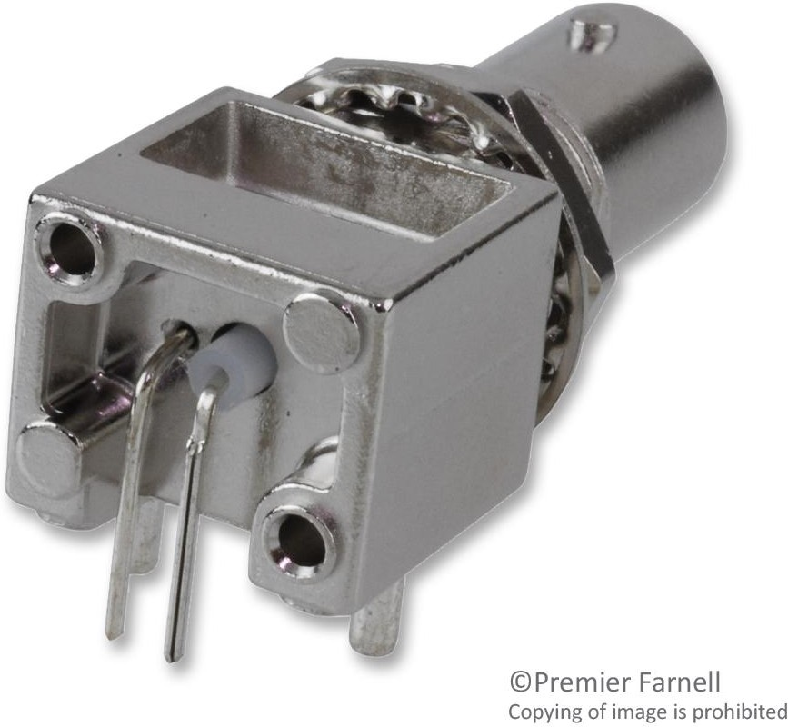
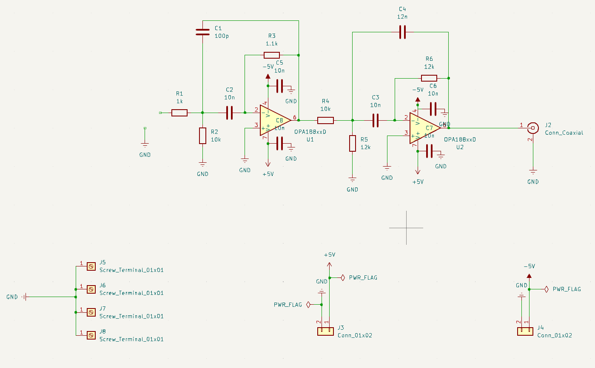
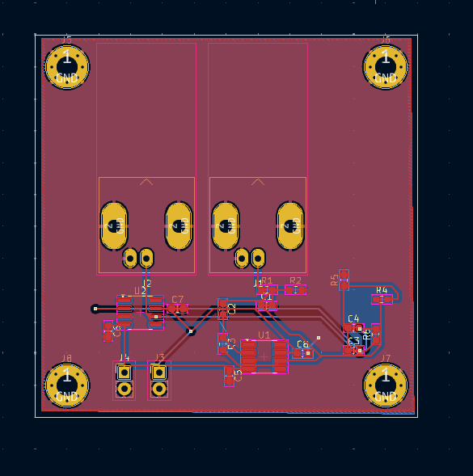

## Main_project
Главный проект. Здесь будут собраны все работы

#Рыжков В.П. БМТ2-31М

## Отчет

Требуется создать схему электрическую-принципиальную платы, трассировку печатной платы и файлы платы для дальнейшего производства. Создание схемы происходит в программе KiCAD.

Плата будет основана на материалах, усвоенных в процессе прохождения курса и представлять из себя будет полосно-пропускающий фильтр на 2-х операционных усилителях. В целях возможности тестирования данной схемы при ее реальном производстве предусмотрены входы для осциллографа.

Поиск посадочных мест, УГО и 3D моделей элементов осуществлялось на сайтах https://www.snapeda.com/ и https://componentsearchengine.com/

В KiCAD были созданы отдельные библиотеки УГО и посадочных мест.

После этого с использованием новых компонентов была собрана схема электрической цепи (СЭП). Для стандартных элементов, таких как резисторы и конденсаторы, были выбраны площадки из библиотек KiCad. 

Затем проводим проверку получившейся СЭП и исправляем обнаруженные ошибки, связанные с подключением пинов, наличию "земли" у каждой микросхемы и др.

Собранная СЭП представлена на рис. 2.

Далее производим разводку печатной платы.

Далее нажимаем "Обновить печатную плату" и получаем печатную плату, после чего производим её разводку. Сначала соединяем контакты, не относящиеся к питанию и земле. Потом проводим питание, и в конце проводим землю. Для избежания перегрева и перегорания дорожек питания были рассчитаны ширины дорожек питания с помощью встроенного калькулятора для силы тока 0.5 Ампер. После проведения дорожек были скорректированы размеры печатной платы и произведена заливка платы GND с обеих сторон. При данной сложности схемы двуслойная плата - достаточна. Более того, оборотный ее слой задействовал в малой степени.

Для всех элементов платы, взятых с сайтов SnapEda и ComponentSearchEngine были выбраны 3D модели.

3D модель печатной платы представлена на следующих изображениях:

Рисунок 6 - Вид платы в 3д

Далее создаем гербер файлы и файлы сверловки.
